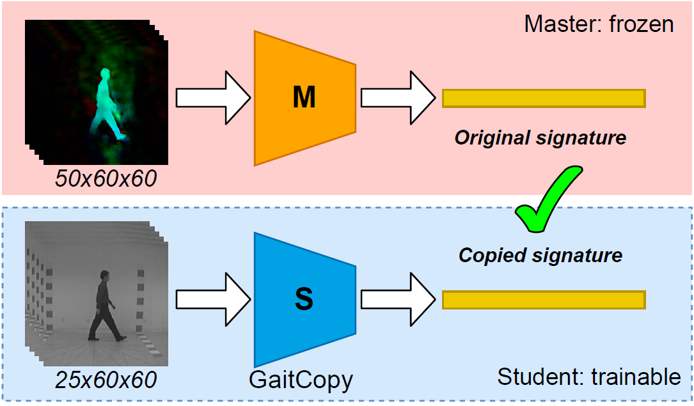

# GaitCopy: disentangling appearance for gait recognition by signature copy

Support code for paper accepted for publication at IEEE Access: [download](https://ieeexplore.ieee.org/document/9646881)

__Code__: coming soon!  
Although you can start playing with the Google Colab notebooks available here: [https://github.com/avagait/gaitutils](https://github.com/avagait/gaitutils)  

## Abstract  
This paper addresses the problem of gait-based people identification by copying optical flow-based signatures. The proposed model, coined as GaitCopy, receives as input a stack of gray images and returns the gait signature of the represented subject. The novel property of this network is that it is not trained to only generate discriminative signatures, but to copy signatures generated by a Master network trained on optical flow inputs. Then, GaitCopy is enforced to extract signatures based on motion and not based on appearance, despite having been trained with pixel inputs. We implement two different versions of GaitCopy, one mainly composed of 3D convolutional layers to capture local temporal information; and a second one based on GaitSet which uses 2D convolutional layers under a temporal setup. We evaluate our approach on two public gait datasets: CASIA-B and TUM-GAID. We observe that compact networks, up to ×4.2 smaller for TUM-GAID, can be obtained by using our approach, while keeping a competitive recognition accuracy with respect to the state of the art, and without the need of explicit optical flow computation. Even with such network compression, the results obtained in TUM-GAID are comparable to those of the state of the art, with an average accuracy of 97% on the test set.

## Proposed method  
The main idea is depicted in the following figure:  

## References
R. Delgado-Escaño; FM. Castro; N. Guil; MJ. Marín-Jiménez. _"UGaitNet: Multimodal gait recognition with missing input modalities"_. [IEEE Access](https://ieeexplore.ieee.org/document/9646881), 2021.
